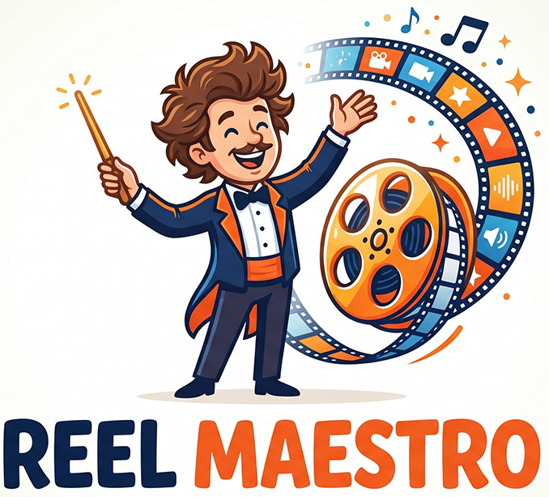

# Reel Maestro

[](https://github.com/spunkytensor/reel-maestro/actions/workflows/ci.yml)

<p align="center">
  
</p>

Reel Maestro is a small, single-binary Rust CLI that turns an idea into a vertical (9:16)
TikTok/Reels/Shorts-style video with **AI-generated narration audio, images, and burned-in
captions** — all through a single **OpenRouter API key**. No Docker, no server, no dashboard.

This project is open source under the [Apache License 2.0](LICENSE). Contributions are
welcome; see [CONTRIBUTING.md](CONTRIBUTING.md) for the development workflow.

## How it works

```
input ──┬─ --topic "..."            ─┐
        ├─ --script narration.txt    ├─→ script (LLM) → narration + scene prompts
        └─ --url "https://..."  ─────┘
                                       │
   text-to-speech ─────────────────────→ audio.mp3
   whisper-timestamped (local) ────────→ word timings  → captions (.ass)
   image generation (per scene) ───────→ 1080×1920 stills
   ffmpeg (Ken Burns + concat + burn + mux) → reel.mp4
```

Audio is the master clock: captions are timed from real word-level timestamps produced by a
local [whisper-timestamped](https://github.com/linto-ai/whisper-timestamped) run (with a
duration-based estimate as a fallback), and each scene image is shown for its proportional
slice of the narration. OpenRouter's hosted transcription endpoint only returns plain text —
no timestamps for any model — so word timing is done locally instead.

## Requirements

- Rust 1.88+ and Cargo.
- `ffmpeg` and `ffprobe` on your PATH (`sudo apt install ffmpeg`).
- A font for captions: defaults to **DejaVu Sans** (`fonts-dejavu`, usually preinstalled).
- An OpenRouter API key with a little credit.
- *(Optional, for exact captions)* [whisper-timestamped](https://github.com/linto-ai/whisper-timestamped)
  on your PATH for real word-level timing (installed via [`uv`](https://docs.astral.sh/uv/) —
  see below). Without it, the tool falls back to estimating word timings from the audio length.

## Supported platforms

Reel Maestro is currently tested on Linux x86_64 in CI. macOS should work with `ffmpeg` and
`ffprobe` installed, but is not CI-tested yet. Windows is not currently supported or tested.
The full render smoke tests are Linux-oriented because they rely on the default DejaVu font path.

## Install

From a clone:

```bash
git clone https://github.com/spunkytensor/reel-maestro.git
cd reel-maestro
cargo install --path .
reelmaestro --help
```

Without cloning:

```bash
cargo install --git https://github.com/spunkytensor/reel-maestro
```

For development without installing:

```bash
cargo run --release -- --topic "octopus cognition"
```

## Configuration

Set your OpenRouter API key in the environment, or copy `.env.example` to `.env` when running
from a clone:

```bash
export OPENROUTER_API_KEY=sk-or-v1-...

# Or, from a checkout:
cp .env.example .env      # paste OPENROUTER_API_KEY into .env
```

## Privacy, costs, and provider terms

Reel Maestro sends your topic, script/brief/article text, generated scene prompts, and requested
media-generation inputs to OpenRouter and the selected model providers. If you pass
`--character-ref`, that image is also sent to the image/video model. Do not use private,
sensitive, or third-party material unless you are allowed to send it to those services.

API calls may incur OpenRouter charges. Model availability, pricing, output rights, and content
policies are governed by OpenRouter and the underlying providers.

### Optional: exact caption timing with whisper-timestamped (via uv)

Real word-level timestamps come from a local `whisper_timestamped` run. Install it with
[`uv`](https://docs.astral.sh/uv/) into a Python virtual environment:

```bash
# 1. Install uv (skip if you already have it)
curl -LsSf https://astral.sh/uv/install.sh | sh
#    then restart your shell, or: source $HOME/.local/bin/env

# 2. Create a virtual environment and install whisper-timestamped into it
uv venv                                  # creates ./.venv (Python 3.x)
source .venv/bin/activate                # activate it (PATH now includes whisper_timestamped)
uv pip install whisper-timestamped

# 3. Verify the CLI is on your PATH
whisper_timestamped --help
```

With the venv **activated**, run `reelmaestro` from the same shell so `whisper_timestamped` is
found on PATH. The first run downloads the chosen Whisper model (`base` by default; pass
`--whisper-model large-v3` for higher accuracy). To use it without activating, point Reel Maestro
at the venv binary directly: `--whisper-cmd .venv/bin/whisper_timestamped` (or
`uv tool install whisper-timestamped` to put it on PATH globally).

## Usage

```bash
# Topic → AI writes the whole script
reelmaestro --topic "octopus cognition"

# Brief/notes file → AI writes a script FROM it (your direction, not verbatim)
reelmaestro --brief ./notes.txt

# Your own narration, used verbatim (AI only plans the visuals)
reelmaestro --script ./my_narration.txt

# From an article URL
reelmaestro --url "https://en.wikipedia.org/wiki/Tardigrade"
```

`--brief` vs `--script`: `--brief <file>` feeds the file to the scriptwriter as source
material/direction (it rewrites it into a punchy narration); `--script <file>` uses the file
verbatim as the narration. (You can also do the brief inline with `--topic "$(cat notes.txt)"`.)

Output lands in a timestamped folder `out/<YYYYMMDD_HHMMSS>_<title-slug>/` (e.g.
`out/20260618_092729_the-sheepdog-and-the-duck/`):
`reel.mp4`, `poster.jpg`, `reel.ass`, `audio.mp3`, `scene-NN.jpg`, `clip-NN.mp4`, `script.json`, `words.json`.

`poster.jpg` is a **custom, purpose-built thumbnail** — the scriptwriter designs an enticing
cover concept (`poster_prompt`) and the image model renders it clean (no captions),
conditioned on the character reference so it matches the reel's cast. It's also embedded into
`reel.mp4` as cover art so players and file browsers show it as the video's thumbnail. On a
`--from` resume an existing `poster.jpg` is reused (re-stitch stays free); if generation ever
fails it falls back to a frame of the reel (`--poster-scene N` picks which scene).

### Flags

| Flag | Default | Purpose |
|---|---|---|
| `--topic` / `--brief` / `--script` / `--url` | — | Input mode (exactly one). `--brief <file>` = AI writes from your notes; `--script <file>` = verbatim narration. |
| `--from <dir>` | — | Resume a prior run folder: reuse its script/audio/captions/images and just re-render (e.g. add `--video`). |
| `--out <dir>` | `out` | Output root directory. |
| `--voice <name>` | auto | TTS voice (model-dependent). If unset, auto-picked from the script's narrator gender (male → `Puck`, female/neutral → `Kore`). |
| `--speed <f64>` | `1.0` | Narration tempo (0.5–2.0), pitch-preserving. |
| `--music-gen` | off | AI-generate a background soundtrack (OpenRouter music model, ~$0.08). |
| `--music <file>` | — | Use your own audio file as the soundtrack (overrides `--music-gen`). |
| `--mix <duck\|low>` | `duck` | How music sits under narration: `duck` = auto-dip under the voice; `low` = constant volume. |
| `--music-volume <f64>` | `0.8` | Background music gain. Higher = louder; raise toward `1.0`+ for a stronger bed. |
| `--video` | off | Render ALL scenes as AI video clips (Veo image-to-video). ~$0.05/sec. |
| `--video-scenes <N>` | — | Render only the first N scenes as video; the rest stay Ken Burns stills (caps cost). |
| `--video-resolution <res>` | `720p` | Veo clip resolution (`720p`/`1080p`). |
| `--character-ref <file>` | — | Use this photo as the recurring character across all scenes (overrides the generated portrait). |
| `--no-consistency` | off | Disable automatic character-consistency conditioning. |
| `--poster-scene <N>` | `0` | Fallback only: which scene's frame to use if custom poster generation fails (0 = hook). |
| `--no-embed-poster` | off | Write `poster.jpg` but don't embed it as the MP4's cover art. |
| `--no-captions` | off | Don't burn captions into the video. |
| `--no-narration` | off | No spoken voiceover — produce a silent or music-only video. |
| `--scene-seconds <f64>` | `4.0` | Per-scene length used when `--no-narration` is set (no audio to time against). |
| `--no-images` | off | Stop right after writing word timings (script + TTS + timing only). Cheap way to test caption timing. |
| `--whisper-cmd <cmd>` | `whisper_timestamped` | Local command that emits word-level timestamps. |
| `--whisper-model <name>` | `base` | Whisper model for local timing (`base`, `small`, `large-v3`, …). |
| `--text-model` / `--image-model` / `--tts-model` / `--music-model` | see `.env.example` | Per-stage OpenRouter model overrides. |

## Models (defaults)

| Stage | Default model | Env override |
|---|---|---|
| Script | `anthropic/claude-sonnet-4-6` | `REELMAESTRO_TEXT_MODEL` |
| Image | `google/gemini-3.1-flash-image` (Nano Banana 2) | `REELMAESTRO_IMAGE_MODEL` |
| TTS | `google/gemini-3.1-flash-tts-preview` (voice `Kore`) | `REELMAESTRO_TTS_MODEL` |
| Word timing | `whisper_timestamped` (**local**, `base` model) | `REELMAESTRO_WHISPER_CMD` / `REELMAESTRO_WHISPER_MODEL` |
| Music (opt-in) | `google/lyria-3-pro-preview` | `REELMAESTRO_MUSIC_MODEL` |
| Video (opt-in) | `google/veo-3.1-lite` | `REELMAESTRO_VIDEO_MODEL` |

Browse current speech models at `https://openrouter.ai/api/v1/models?output_modalities=speech`
(TTS). Note OpenAI TTS voices (`alloy`, `nova`) differ from Gemini voices (`Kore`, `Charon`,
`Puck`, …) — pick a voice that matches your `--tts-model`. Word timing is **not** an OpenRouter
call — it runs `whisper_timestamped` locally (OpenRouter's transcription endpoint returns
text only, no timestamps).

A default run is one script call + one TTS call + ~5 image calls (plus a local, free
whisper-timestamped run) — typically a few cents.

## Soundtrack (optional)

By default there's no music. Two ways to add one:

```bash
# AI-generate an instrumental matching the topic (Lyria 3 on your OpenRouter key, ~$0.08)
reelmaestro --topic "octopus cognition" --music-gen

# Or drop in your own track
reelmaestro --topic "octopus cognition" --music ./track.mp3

# Choose how it sits under the voice (default: duck)
reelmaestro --topic "..." --music-gen --mix low
```

- The scriptwriter emits a `music_prompt` (genre/tempo/instruments, always instrumental)
  used for `--music-gen`. It's saved in `script.json` either way.
- `--mix duck` (default) ducks the music under the narration via gentle sidechain
  compression (it stays audible, just dips under speech); `--mix low` holds it at a
  constant volume. Either way the track is looped to the video length with fade in/out.
- `--music-volume` (default `0.8`) sets the music gain — raise it (e.g. `1.0`+) for a
  louder bed, lower it if the music competes with the voice.
- Music generation is **non-fatal**: if the (preview) music model fails, Reel Maestro prints
  a warning and finishes the reel without music.
- `google/lyria-3-pro-preview` is a preview model; audio is streamed back over SSE. Swap
  it with `--music-model` if a better music model appears in
  `https://openrouter.ai/api/v1/models`.

## Character consistency

When a person or animal recurs through the story, Reel Maestro keeps them looking like the
**same** individual across every scene (and, with `--video*`, across the video clips too,
since each clip is seeded from its still).

How it works: the scriptwriter emits a `cast` description (saved in `script.json`). If it's
non-empty, Reel Maestro generates one **character reference portrait** (`character-ref.jpg`),
then conditions every scene image on it — Nano Banana preserves the subject's identity while
changing the setting. This is **automatic**; no flag needed.

```bash
# Recurring subject → same dog in every scene, automatically
reelmaestro --topic "a day in the life of a golden retriever puppy"

# Pin a specific real person/mascot as the recurring character
reelmaestro --topic "..." --character-ref ./me.jpg

# Turn it off (independent images per scene, slightly faster)
reelmaestro --topic "..." --no-consistency
```

- Abstract topics with no recurring subject (the `cast` comes back empty) skip this and use
  the faster independent path — nothing to configure.
- Cost is negligible: one extra portrait image (~$0.004) plus a small reference input per
  scene. If the portrait fails, it falls back to independent generation (non-fatal).
- Requires an image model that accepts image input (the default `google/gemini-3.1-flash-image`
  does).

## Preview-then-upgrade workflow

Generate a cheap **image preview** first, decide if you like it, then add Veo video to the
*same* reel without re-paying for the script, narration, captions, or images:

```bash
# 1. Preview — images + Ken Burns only (no Veo). Cheap.
reelmaestro --topic "a fox and a hare become friends"
#   → out/20260618_141530_a-fox-and-a-hare-become-friends/

# 2. Like it? Resume that exact folder and add video. Only the Veo clips are billed.
reelmaestro --from out/20260618_141530_a-fox-and-a-hare-become-friends/ --video
#   (or --video-scenes 2 to animate just the hook)
```

`--from <dir>` reuses the folder's `script.json`, `audio.mp3`, `words.json`, `scene-NN.jpg`,
and any soundtrack, so the video matches the preview you approved. It re-renders `reel.mp4`
in place. You can also use it to just re-stitch (e.g. after tweaking a scene image by hand),
or add a soundtrack later with `--from <dir> --music-gen`. Resuming with no `--video` does a
pure local re-assemble (no API calls).

## Video scenes (optional, costs real money)

By default each scene is a still with a Ken Burns zoom (free). You can instead animate
scenes into real AI video clips via Veo (image-to-video — the generated still is the first
frame), at **~$0.05/sec** on the default `google/veo-3.1-lite`.

```bash
# Animate just the hook (cheapest way to add motion, ~$0.30)
reelmaestro --topic "octopus cognition" --video-scenes 1

# Animate every scene (~$1.50 for a ~30s reel)
reelmaestro --topic "octopus cognition" --video

# Higher resolution / different model
reelmaestro --topic "..." --video --video-resolution 1080p --video-model google/veo-3.1-fast
```

- Cost scales with total video seconds. Each scene is billed at its clip length, clamped to
  Veo's 4–8s range. Reel Maestro prints an estimate before generating, e.g.
  `→ generating 2 video scene(s) (google/veo-3.1-lite, ~12s ≈ $0.60) ...`.
- Generation is **non-fatal per scene**: if a clip fails (or the job times out), that scene
  falls back to its Ken Burns still — one bad/expensive clip never kills the run.
- We request `generate_audio: false` (you already have narration), which keeps Veo cheaper.
- Veo is an async job API (submit → poll → download); clips take ~30s–several minutes each,
  generated concurrently. Expect a few minutes of wall-clock for a full `--video` run.

## Testing

Test in three layers, cheapest first. Run them in order — each one isolates a different
half of the tool, so when something breaks you know where to look.

### Layer 1 — logic only (no ffmpeg, no API key)

Pure unit tests for caption packing and ASS timing, plus build/CLI sanity checks. Instant
and free.

```bash
cargo test            # 4 caption/timing tests
cargo build
cargo run -- --help
cargo run -- --topic a --url b   # confirms arg-conflict handling
```

### Layer 2 — full render pipeline, free (needs only ffmpeg)

Exercises the entire back half of the tool — `captions → Ken Burns → concat → burn-in →
mux` — using **synthetic** images, a 6s tone, and fake word-timings. It makes **zero API
calls**, so it costs nothing and is repeatable. This is how you validate your ffmpeg setup
and the rendering path before spending anything.

```bash
sudo apt install ffmpeg
cargo test render_smoke -- --ignored --nocapture
```

It asserts the output is a genuine ~6s, 1080×1920 `reel.mp4`. The result lands in
`$TMPDIR/reelmaestro_render_smoke/reel.mp4` — open it to eyeball captions and motion. (The
test is marked `#[ignore]` so it never runs during a plain `cargo test`.)

### Layer 3 — real end-to-end (needs ffmpeg + OpenRouter key, costs a few cents)

```bash
cp .env.example .env        # paste OPENROUTER_API_KEY
# cheapest path first: --script skips the scriptwriting LLM call
cargo run -- --script tests/sample_script.txt
# then the AI-writes-everything paths:
cargo run -- --topic "octopus cognition"
cargo run -- --url "https://en.wikipedia.org/wiki/Tardigrade"
```

Then inspect `out/<slug>/`:

- `words.json` — the word timings used for captions. Entries with gaps between one word's
  `end_s` and the next word's `start_s` are real timestamps from `whisper_timestamped`;
  perfectly contiguous spans mean it fell back to the duration estimate (tool not installed
  or it errored — check the `note:` lines in the run output).
- `reel.mp4` — `ffprobe out/<slug>/reel.mp4` should show 1080×1920 H.264+AAC with duration
  ≈ your audio. Play it to check caption sync and that images match the scenes.
- `script.json` / `scene-NN.jpg` — inspect what the models produced. A broken `scene-*.jpg`
  ⇒ image-generation problem (the tool falls back to a solid placeholder so the run still
  completes).

### Recommended order

**Layer 1** (instant) → **Layer 2** (free, proves ffmpeg + render) → **Layer 3** `--script`
mode (cheapest live run, isolates the API calls). Because Layer 2 already proved the render
path, any Layer 3 failure points at a specific stage: estimated (contiguous) `words.json` ⇒
`whisper_timestamped` missing/failing, a placeholder `scene-*.jpg` ⇒ image-gen, a script
error ⇒ the text model.

> Tip: `--no-images` runs only script + TTS + word timing and stops, so you can check
> caption timing for a couple of cents without paying for images.

## Contributing

Issues and pull requests are welcome. Please read [CONTRIBUTING.md](CONTRIBUTING.md) before
opening a PR so local checks, generated artifacts, and license expectations stay consistent.

## Security

Please do not open public issues containing secrets or vulnerability details. See
[SECURITY.md](SECURITY.md) for supported versions and private reporting guidance.

## Credits and cross-references

- [OpenRouter](https://openrouter.ai/) provides the hosted text, image, speech, music, and
  video model APIs used by Reel Maestro.
- [FFmpeg](https://ffmpeg.org/) and `ffprobe` handle the local render, muxing, subtitle burn-in,
  poster extraction, and media inspection steps.
- [whisper-timestamped](https://github.com/linto-ai/whisper-timestamped) provides local
  word-level caption timestamps; [`uv`](https://docs.astral.sh/uv/) is the documented install
  path for its Python environment.
- [`reels-af`](https://github.com/Agent-Field/reels-af) inspired the idea; Reel Maestro keeps a
  smaller Rust CLI architecture and does not share code with that project.

## License

Reel Maestro is licensed under the [Apache License 2.0](LICENSE). Unless explicitly marked
otherwise, contributions submitted to this repository are accepted under the same license.
