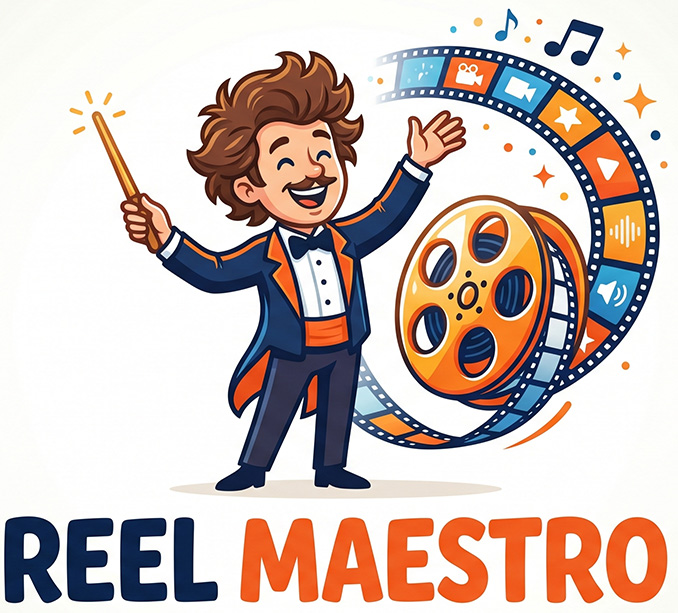
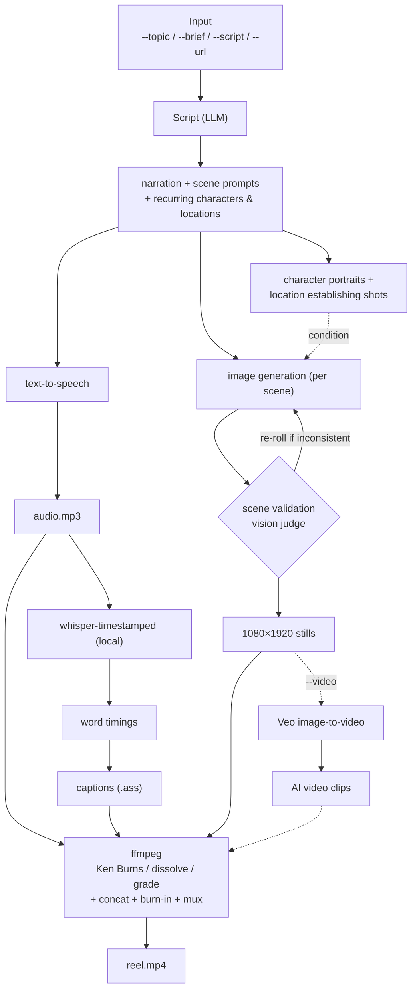
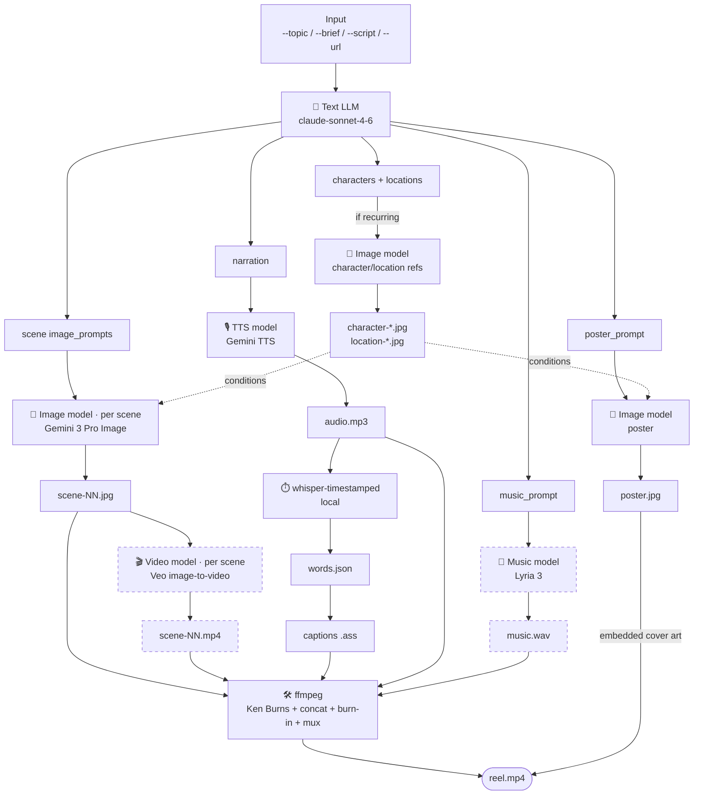

# Reel Maestro

[](https://github.com/spunkytensor/reel-maestro/actions/workflows/ci.yml)

<p align="center">
  
</p>

Reel Maestro is a small, single-binary Rust CLI that turns an idea into a video with
**AI-generated narration audio, images, and burned-in captions** — all through a single
**OpenRouter API key**. It makes both vertical (9:16) TikTok/Reels/Shorts reels and, with
`--format youtube`, landscape (16:9) long-form YouTube videos with a chaptered script and
pastable metadata. No Docker, no server, no dashboard.

This project is open source under the [Apache License 2.0](LICENSE). Contributions are
welcome; see [CONTRIBUTING.md](CONTRIBUTING.md) for the development workflow.

See https://www.youtube.com/@ReelMaestroSamples for examples of reels created with this project, including sample prompts.

## How it works


```mermaid
flowchart TD
    input["Input<br/>--topic / --brief / --script / --url"] --> script["Script (LLM)"]
    script --> plan["narration + scene prompts<br/>+ recurring characters & locations"]

    plan --> tts["text-to-speech"] --> audio["audio.mp3"]
    audio --> whisper["whisper-timestamped (local)"] --> words["word timings"] --> caps["captions (.ass)"]

    plan --> refs["character portraits +<br/>location establishing shots"]
    plan --> img["image generation (per scene)"]
    refs -.->|"condition"| img
    img --> judge{"scene validation<br/>vision judge"}
    judge -->|"re-roll if inconsistent"| img
    judge --> stills["1080×1920 stills"]
    stills -.->|"--video"| veo["Veo image-to-video"] --> clips["AI video clips"]

    audio --> ff["ffmpeg<br/>Ken Burns / dissolve / grade<br/>+ concat + burn-in + mux"]
    caps --> ff
    stills --> ff
    clips -.-> ff
    ff --> reel["reel.mp4"]
```

Audio is the master clock: captions are timed from real word-level timestamps produced by a
local [whisper-timestamped](https://github.com/linto-ai/whisper-timestamped) run (with a
duration-based estimate as a fallback), and each scene **cut is snapped to the word being
spoken** so visuals land on the narration. OpenRouter's hosted transcription endpoint only
returns plain text — no timestamps for any model — so word timing is done locally instead.

Recurring people, animals, and places are locked across scenes: a **reference portrait** per
character and an **establishing shot** per location are generated first, then every scene image
is conditioned on them and checked by a **vision judge** that re-rolls drifting or malformed frames
(see [Realism and consistency](#realism-and-consistency)). Scenes are Ken Burns stills by default;
`--video` animates them into **Veo** clips.

The same pipeline also produces landscape long-form videos with `--format youtube`: the script is
planned as chapters, each chapter renders to its own segment, and the segments are
stream-concatenated into one video (see [Long-form YouTube mode](#long-form-youtube-mode)).

## Requirements

- Rust 1.88+ and Cargo.
- `ffmpeg` and `ffprobe` on your PATH (see [Install ffmpeg](#install-ffmpeg) below).
- A font for captions: defaults to **DejaVu Sans** (`fonts-dejavu`, usually preinstalled).
- An OpenRouter API key with a little credit.
- *(Optional, for exact captions)* [whisper-timestamped](https://github.com/linto-ai/whisper-timestamped)
  on your PATH for real word-level timing (installed via [`uv`](https://docs.astral.sh/uv/) —
  see below). Without it, the tool falls back to estimating word timings from the audio length.

## Supported platforms

Reel Maestro is currently tested on Linux x86_64 in CI. macOS should work with `ffmpeg` and
`ffprobe` installed, but is not CI-tested yet. Windows is not currently supported or tested.
The full render smoke tests are Linux-oriented because they rely on the default DejaVu font path.

## Install ffmpeg

Reel Maestro shells out to `ffmpeg` (render/mux/burn-in) and `ffprobe` (media inspection), so
both must be on your PATH before running. Install via your platform's package manager:

```bash
# Debian/Ubuntu
sudo apt install ffmpeg

# Fedora
sudo dnf install ffmpeg

# macOS (Homebrew) — not CI-tested, but should work (see Supported platforms)
brew install ffmpeg
```

`ffprobe` ships alongside `ffmpeg` in both of the above. Verify both resolve:

```bash
ffmpeg -version
ffprobe -version
```

## Install

From a clone:

```bash
git clone https://github.com/spunkytensor/reel-maestro.git
cd reel-maestro
cargo install --path .
reelmaestro --help
```

Without cloning:

```bash
cargo install --git https://github.com/spunkytensor/reel-maestro
```

For development without installing:

```bash
cargo run --release -- --topic "octopus cognition"
```

## Configuration

Set your OpenRouter API key in the environment, or copy `.env.example` to `.env` when running
from a clone:

```bash
export OPENROUTER_API_KEY=replace-with-your-real-openrouter-key

# Or, from a checkout:
cp .env.example .env      # paste OPENROUTER_API_KEY into .env
```

## Privacy, costs, and provider terms

Reel Maestro sends your topic, script/brief/article text, generated scene prompts, and requested
media-generation inputs to OpenRouter and the selected model providers. If you pass
`--character-ref`, that image is also sent to the image/video model. Do not use private,
sensitive, or third-party material unless you are allowed to send it to those services.

API calls may incur OpenRouter charges. Model availability, pricing, output rights, and content
policies are governed by OpenRouter and the underlying providers.

### Optional: exact caption timing with whisper-timestamped (via uv)

Real word-level timestamps come from a local `whisper_timestamped` run. Install it with
[`uv`](https://docs.astral.sh/uv/) into a Python virtual environment:

```bash
# 1. Install uv (skip if you already have it)
curl -LsSf https://astral.sh/uv/install.sh | sh
#    then restart your shell, or: source $HOME/.local/bin/env

# 2. Create a virtual environment and install whisper-timestamped into it
uv venv                                  # creates ./.venv (Python 3.x)
source .venv/bin/activate                # activate it (PATH now includes whisper_timestamped)
uv pip install whisper-timestamped       # tested with 1.15.9 (see note below)

# 3. Verify the CLI is on your PATH
whisper_timestamped --help
```

> **Tested version:** Reel Maestro is tested against `whisper-timestamped` **1.15.9**.
> Other versions generally work — Reel Maestro tolerates the different word-timing
> JSON filenames that different releases emit (e.g. `audio.words.json` vs. `audio.json`).
> If you want byte-for-byte reproducibility with our testing, pin it:
> `uv pip install whisper-timestamped==1.15.9`.

With the venv **activated**, run `reelmaestro` from the same shell so `whisper_timestamped` is
found on PATH. The first run downloads the chosen Whisper model (`base` by default; pass
`--whisper-model large-v3` for higher accuracy). To use it without activating, point Reel Maestro
at the venv binary directly: `--whisper-cmd .venv/bin/whisper_timestamped` (or
`uv tool install whisper-timestamped` to put it on PATH globally).

## Usage

```bash
# Topic → AI writes the whole script
reelmaestro --topic "octopus cognition"

# Brief/notes file → AI writes a script FROM it (your direction, not verbatim)
reelmaestro --brief ./notes.txt

# Your own narration, used verbatim (AI only plans the visuals)
reelmaestro --script ./my_narration.txt

# From an article URL
reelmaestro --url "https://en.wikipedia.org/wiki/Tardigrade"
```

`--brief` vs `--script`: `--brief <file>` feeds the file to the scriptwriter as source
material/direction (it rewrites it into a punchy narration); `--script <file>` uses the file
verbatim as the narration. (You can also do the brief inline with `--topic "$(cat notes.txt)"`.)

Output lands in a timestamped folder `out/<YYYYMMDD_HHMMSS>_<title-slug>/` (e.g.
`out/20260618_092729_the-sheepdog-and-the-duck/`):
`reel.mp4`, `poster.jpg`, `reel.ass`, `audio.mp3`, `scene-NN.jpg`, `scene-NN.mp4` (video clips),
`script.json`, `words.json`. A `--format youtube` run is 1920×1080 and adds `youtube.md` (pastable
metadata) plus per-chapter `segment-NN.mp4` intermediates (and `chapter-NN.mp3` if the single TTS
call had to fall back to per-chapter synthesis) — see [Long-form YouTube mode](#long-form-youtube-mode).

A reel that includes AI **video** clips is written as **`reel-video.mp4`** instead of `reel.mp4`, so a
still preview and a later video upgrade of the same run can coexist in the folder rather than one
overwriting the other (see [Preview-then-upgrade](#preview-then-upgrade-workflow)).

`poster.jpg` is a **custom, purpose-built thumbnail** — the scriptwriter designs an enticing
cover concept (`poster_prompt`) and the image model renders it clean (no captions),
conditioned on the character reference so it matches the reel's cast. It's also embedded into
`reel.mp4` as cover art so players and file browsers show it as the video's thumbnail. On a
`--from` resume an existing `poster.jpg` is reused (re-stitch stays free); if generation ever
fails it falls back to a frame of the reel (`--poster-scene N` picks which scene).

### Flags

| Flag | Default | Purpose |
|---|---|---|
| `--topic` / `--brief` / `--script` / `--url` | — | Input mode (exactly one). `--brief <file>` = AI writes from your notes; `--script <file>` = verbatim narration. |
| `--from <dir>` | — | Resume a prior run folder: reuse its script/audio/captions/images and just re-render (e.g. add `--video`). Plain resumes are local/free and do not require `OPENROUTER_API_KEY`; conflicts with `--out` and `--no-images`. |
| `--out <dir>` | `out` | Output root directory for fresh runs. |
| `--voice <name>` | auto | TTS voice (model-dependent). If unset, auto-picked from the script's narrator gender (male → `Puck`, female/neutral → `Kore`). |
| `--speed <f64>` | `1.0` | Narration tempo (0.5–2.0), pitch-preserving. |
| `--music-gen` | off | AI-generate a background soundtrack (OpenRouter music model, ~$0.08); conflicts with `--music`. |
| `--music <file>` | — | Use your own audio file as the soundtrack; copied into the run folder as `music.<ext>` so `--from` can reuse it. |
| `--mix <duck\|low>` | `duck` | How music sits under narration: `duck` = auto-dip under the voice; `low` = constant volume. |
| `--music-volume <f64>` | `0.6` | Background music gain. Higher = louder; raise toward `1.0`+ for a stronger bed. |
| `--video` | off | Render ALL scenes as AI video clips (Veo image-to-video). Cost depends on the video model/resolution (default Veo 3.1 Lite ≈ $0.05/sec at 720p). |
| `--video-scenes <N>` | — | Render only the first N scenes as video; the rest stay Ken Burns stills (caps cost). |
| `--video-resolution <res>` | tier (`720p`) | Veo clip resolution (`720p`/`1080p`). Defaults from the quality tier (`1080p` on `premium`). |
| `--quality <draft\|standard\|premium>` | `standard` | Quality/cost tier presetting the model defaults: `draft` = cheapest models + validation off (~3-5x cheaper); `premium` = Opus script, Veo 3.1 Fast 1080p, deepest validation. Explicit model flags/envs still override. |
| `--format <reel\|youtube>` | `reel` | Output format. `youtube` = landscape 16:9 long-form with a chaptered script, single-call TTS with per-chapter fallback, chunked rendering, a 1280x720 thumbnail, and a `youtube.md` metadata file (title/description/tags/chapter timestamps). |
| `--minutes <N>` | `3` | Target length in minutes for `--format youtube` (1-12). Drives the narration word budget, scene count, and chapter count (~1/min). |
| `--character-ref <file>` | — | Use this photo as the recurring character across all scenes (overrides the generated portrait). |
| `--watermark <file>` | — | Overlay a watermark (PNG with alpha) on the final video, bottom-right, auto-scaled to the format (≈6% of frame width). Works on fresh runs and `--from` resumes. |
| `--no-consistency` | off | Disable automatic character-consistency conditioning. |
| `--poster-scene <N>` | `0` | Fallback only: which scene's frame to use if custom poster generation fails (0 = hook). |
| `--no-embed-poster` | off | Write `poster.jpg` but don't embed it as the MP4's cover art. |
| `--no-captions` | off | Don't burn captions into the video. |
| `--no-dissolve` | off | Force hard cuts between every scene (disable cross-dissolves). |
| `--dissolve-seconds <f64>` | `0.5` | Cross-dissolve length for scriptwriter-flagged still→still transitions. |
| `--no-grade` | off | Disable the unified cinematic colour grade / film grain + cross-scene exposure match. |
| `--validate-scene <off\|2\|3>` | tier (`2`) | Per-scene consistency validation: generate candidates and keep the most consistent (vision-judged), re-rolling drifting frames. `off` = one candidate, no judging; `2` / `3` = up to that many candidates at up to N× image cost. Defaults from the quality tier (off on `draft`, 3 on `premium`). |
| `--no-narration` | off | No spoken voiceover — produce a silent or music-only video. |
| `--scene-seconds <f64>` | `4.0` | Per-scene length used when `--no-narration` is set (no audio to time against). |
| `--no-images` | off | Stop right after writing word timings (script + TTS + timing only). Cheap way to test caption timing. |
| `--whisper-cmd <cmd>` | `whisper_timestamped` | Local command that emits word-level timestamps. |
| `--whisper-model <name>` | `base` | Whisper model for local timing (`base`, `small`, `large-v3`, …). |
| `--text-model` / `--image-model` / `--tts-model` / `--music-model` / `--judge-model` | see `.env.example` | Per-stage OpenRouter model overrides (the judge is the multimodal model scoring scene consistency). |

## Long-form YouTube mode

```bash
reelmaestro --topic "the history of espresso" --format youtube --minutes 5
```

`--format youtube` switches the whole pipeline to landscape 16:9 long-form:

- **Chaptered script** — one outline call plans the arc, characters/locations canon, YouTube
  description and tags; then one call per chapter (~1/minute) writes that chapter's narration
  and scenes with the full outline + canon as context. Scene/character consistency machinery
  (reference portraits, text locks, the vision judge) works exactly as in reel mode.
- **Single-call narration** — the whole narration is synthesized in one TTS call so the voice
  stays consistent for the entire video (a generative TTS like the default Gemini re-samples the
  speaker on each independent call, so splitting per chapter makes the voice shift at the seams).
  Only if a single call comes back truncated on a very long script does it fall back to
  per-chapter synthesis (`chapter-NN.mp3`, concatenated) — a complete narration is worth the
  possible seam. For a rock-solid voice on very long videos, use a classic named-voice model:
  `--tts-model microsoft/mai-voice-2 --voice <a MAI voice>` (fresh run — resume reuses the
  existing audio).
- **Chunked rendering** — each chapter renders to a video-only `segment-NN.mp4`, then segments
  are stream-copy concatenated and the narration/music mix is muxed once. Dozens of scenes never
  sit in one giant ffmpeg filtergraph.
- **Outputs** — a 1920x1080 `reel.mp4` (or `reel-video.mp4`), a 1280x720 `poster.jpg` thumbnail,
  and `youtube.md` with the title, description, tags, and `0:00`-style chapter timestamps ready
  to paste into a YouTube upload.
- **Video model** — the default becomes `alibaba/wan-2.6` (~$0.04/s, clips up to 15s, so long
  scene windows aren't slow-motion-stretched like 8s-capped Veo clips). Wan is newer to this
  pipeline than Veo; switch back per run with `--video-model google/veo-3.1-lite`. Cost scales
  with length: `--video` on a 5-minute video is roughly $12 at Wan rates — prefer Ken Burns
  stills plus a few `--video-scenes` highlights.
- Captions stay on, restyled smaller for the 16:9 canvas (`--no-captions` still applies). A
  single generated music track loops for the whole video, which can get audibly repetitive on
  long runs — consider `--music <file>` with a longer track.

`--from <dir>` resume reads the stored format from `script.json`, so re-renders and `--video`
upgrades keep the right geometry automatically.

## Models (defaults)

Model defaults come from the `--quality` tier (`REELMAESTRO_QUALITY`); the table shows the
`standard` tier. Explicit per-model flags/envs always override the tier's pick.

| Stage | Default model (standard) | Env override |
|---|---|---|
| Script | `anthropic/claude-sonnet-4-6` | `REELMAESTRO_TEXT_MODEL` |
| Consistency judge | `google/gemini-2.5-flash` | `REELMAESTRO_JUDGE_MODEL` |
| Image | `google/gemini-3-pro-image` (Gemini 3 Pro Image) | `REELMAESTRO_IMAGE_MODEL` |
| TTS | `google/gemini-3.1-flash-tts-preview` (voice `Kore`) | `REELMAESTRO_TTS_MODEL` |
| Word timing | `whisper_timestamped` (**local**, `base` model) | `REELMAESTRO_WHISPER_CMD` / `REELMAESTRO_WHISPER_MODEL` |
| Music (opt-in) | `google/lyria-3-pro-preview` | `REELMAESTRO_MUSIC_MODEL` |
| Video (opt-in) | `google/veo-3.1-lite` (youtube mode: `alibaba/wan-2.6`) | `REELMAESTRO_VIDEO_MODEL` |

Tier deltas: `--quality draft` swaps the script model to `anthropic/claude-haiku-4-5`, images to
`google/gemini-3.1-flash-image` (Nano Banana 2, ~half the image cost), the judge to
`google/gemini-3.1-flash-lite`, and turns scene validation off. `--quality premium` upgrades the
script to `anthropic/claude-opus-4-8`, video to `google/veo-3.1-fast` at `1080p`
(~$0.12/sec), and validation to 3 candidates/scene.

Browse current speech models at `https://openrouter.ai/api/v1/models?output_modalities=speech`
(TTS). Note OpenAI TTS voices (`alloy`, `nova`) differ from Gemini voices (`Kore`, `Charon`,
`Puck`, …) — pick a voice that matches your `--tts-model`. Word timing is **not** an OpenRouter
call — it runs `whisper_timestamped` locally (OpenRouter's transcription endpoint returns
text only, no timestamps).

A default run is one script call + one TTS call + a handful of image calls on
`google/gemini-3-pro-image` (one per scene, plus character references and the poster, and the
default `--validate-scene 2` may generate a second candidate per scene), plus a local, free
whisper-timestamped run — typically around 10–20 cents. For cheaper drafts, set
`--image-model google/gemini-3.1-flash-image` (about half the cost, lower coherence); see the
image-model options and cost table in `.env.example`.

## Soundtrack (optional)

By default there's no music. Two ways to add one:

```bash
# AI-generate an instrumental matching the topic (Lyria 3 on your OpenRouter key, ~$0.08)
reelmaestro --topic "octopus cognition" --music-gen

# Or drop in your own track
reelmaestro --topic "octopus cognition" --music ./track.mp3

# Choose how it sits under the voice (default: duck)
reelmaestro --topic "..." --music-gen --mix low
```

- The scriptwriter emits a `music_prompt` (genre/tempo/instruments, always instrumental)
  used for `--music-gen`. It's saved in `script.json` either way.
- `--mix duck` (default) ducks the music under the narration via gentle sidechain
  compression (it stays audible, just dips under speech); `--mix low` holds it at a
  constant volume. Either way the track is looped to the video length with fade in/out.
- `--music-volume` (default `0.6`) sets the music gain — raise it (e.g. `1.0`+) for a
  louder bed, lower it if the music competes with the voice.
- Music generation is **non-fatal**: if the (preview) music model fails, Reel Maestro prints
  a warning and finishes the reel without music.
- `google/lyria-3-pro-preview` is a preview model; audio is streamed back over SSE. Swap
  it with `--music-model` if a better music model appears in
  `https://openrouter.ai/api/v1/models`.

## Character consistency

When a person or animal recurs through the story, Reel Maestro keeps them looking like the
**same** individual across every scene (and, with `--video*`, across the video clips too,
since each clip is seeded from its still).

How it works: the scriptwriter emits recurring `characters` and `locations` (saved in
`script.json`). Reel Maestro generates reference portraits/establishing shots for them, then
conditions every scene image on the relevant references — the image model preserves identities and
settings while changing the action. This is **automatic**; no flag needed.

```bash
# Recurring subject → same dog in every scene, automatically
reelmaestro --topic "a day in the life of a golden retriever puppy"

# Pin a specific real person/mascot as the recurring character
reelmaestro --topic "..." --character-ref ./me.jpg

# Turn it off (independent images per scene, slightly faster)
reelmaestro --topic "..." --no-consistency
```

- Abstract topics with no recurring subject (no recurring `characters`/`locations`) skip this and use
  the faster independent path — nothing to configure.
- Cost is modest: one reference image per recurring character/location plus small reference inputs
  per scene. If a reference fails, it falls back to independent generation for that reference
  (non-fatal).
- Requires an image model that accepts image input (the default `google/gemini-3-pro-image`
  does).

## Preview-then-upgrade workflow

Generate a cheap **image preview** first, decide if you like it, then add Veo video to the
*same* reel without re-paying for the script, narration, captions, or images:

```bash
# 1. Preview — images + Ken Burns only (no Veo). Cheap.
reelmaestro --topic "a fox and a hare become friends"
#   → out/20260618_141530_a-fox-and-a-hare-become-friends/

# 2. Like it? Resume that exact folder and add video. Only the Veo clips are billed.
reelmaestro --from out/20260618_141530_a-fox-and-a-hare-become-friends/ --video
#   (or --video-scenes 2 to animate just the hook)
```

`--from <dir>` reuses the folder's `script.json`, `audio.mp3`, `words.json`, `scene-NN.jpg`,
poster, and any soundtrack, so the video matches the preview you approved. A still re-render (no `--video`)
writes `reel.mp4`; the **video upgrade writes `reel-video.mp4`**, leaving the still `reel.mp4` intact
so you keep both versions. You can also use `--from` to just re-stitch (e.g. after tweaking a scene
image by hand), or add a soundtrack later with `--from <dir> --music-gen`. Resuming with no `--video`
does a pure local re-assemble (no API calls, no API key required). `--poster-scene` explicitly
requests a new generated poster on resume and therefore uses OpenRouter.

## Video scenes (optional, costs real money)

By default each scene is a still with a Ken Burns zoom (free). You can instead animate
scenes into real AI video clips via Veo (image-to-video — the generated still is the first
frame), at **~$0.05/sec** on the default `google/veo-3.1-lite`.

```bash
# Animate just the hook (cheapest way to add motion, ~$0.30)
reelmaestro --topic "octopus cognition" --video-scenes 1

# Animate every scene (~$1.50 for a ~30s reel)
reelmaestro --topic "octopus cognition" --video

# Higher resolution / different model
reelmaestro --topic "..." --video --video-resolution 1080p --video-model google/veo-3.1-fast
```

- Cost scales with total video seconds. Each scene is billed at its clip length, clamped to
  Veo's 4–8s range. Reel Maestro prints an estimate before generating, e.g.
  `→ generating 2 video scene(s) (google/veo-3.1-lite, ~12s ≈ $0.60) ...`.
- Generation is **non-fatal per scene**: if a clip fails (or the job times out), that scene
  falls back to its Ken Burns still — one bad/expensive clip never kills the run.
- **Clips are reused, so you can regenerate just one scene.** A scene's clip is saved as
  `scene-NN.mp4`; on a re-run, any clip already on disk is reused (not re-billed). So if you like
  the video except for one scene, **delete that `scene-NN.mp4` and re-run `--from … --video`** —
  only the missing clip regenerates and everything else is re-assembled as-is. The cost estimate
  reflects only the scenes actually being generated (e.g. `generating 1 video scene(s), reusing 5`).
- We request `generate_audio: false` (you already have narration), which keeps Veo cheaper.
- Veo is an async job API (submit → poll → download); clips take ~30s–several minutes each,
  generated concurrently. Expect a few minutes of wall-clock for a full `--video` run.

## Transitions

Scene boundaries are hard cuts by default, but the scriptwriter marks soft beats (time passing,
imagination/dream shifts, staying in one place) for a **cross-dissolve**, emitted per scene as
`transition` in `script.json`. At render time a dissolve is applied only between two consecutive
**Ken Burns stills** (any junction touching a video clip stays a hard cut).

- It's **on by default**; pass `--no-dissolve` for hard cuts everywhere, or
  `--dissolve-seconds <f64>` (default `0.5`) to tune the fade length.
- Cross-dissolves never change the runtime: the outgoing still is extended by exactly the overlap,
  so total video length stays equal to the narration (captions/audio remain in sync). Very short
  scenes auto-fall back to a cut.

## Realism and consistency

Independently generated scene images tend to mismatch (different exposure/white balance) and look
"AI-clean." Reel Maestro pulls them into one believable shoot:

- **Unified grade (on by default).** The whole reel gets a subtle cinematic grade — gentle
  contrast/saturation, a soft S-curve, a light vignette, and fine film grain — plus a **cross-scene
  exposure match** that nudges every still toward the group's median brightness. Disable with
  `--no-grade`.
- **House look in prompts.** Every scene/poster prompt carries one consistent photographic style
  (full-frame 50mm, natural skin texture, soft directional light, shallow depth of field, subtle
  grain), so frames share a look and avoid the plastic/CGI tell.
- **Labeled, multi-view references.** Each reference image (per-character portrait — front + a
  3/4 view — and the location establishing shot) is sent to the image model *labeled inline*, so it
  binds each image to the right person/place instead of guessing — fewer identity swaps and ghosts.
- **Scene validation (on by default).** Each scene generates `--validate-scene` candidates (default
  `2`) and keeps the one a vision model judges most consistent with the references (correct people,
  wardrobe, setting; no extra/ghost/malformed subjects; coherent structures; single unified frame),
  re-rolling drifting frames. Set `--validate-scene off` to turn it off, or `3` to try harder — each
  candidate is an extra image generation.

## Testing

Test in three layers, cheapest first. Run them in order — each one isolates a different
half of the tool, so when something breaks you know where to look.

### Layer 1 — logic only (no ffmpeg, no API key)

Pure unit tests for caption packing and ASS timing, plus build/CLI sanity checks. Instant
and free.

```bash
cargo test            # 4 caption/timing tests
cargo build
cargo run -- --help
cargo run -- --topic a --url b   # confirms arg-conflict handling
```

### Layer 2 — full render pipeline, free (needs only ffmpeg)

Exercises the entire back half of the tool — `captions → Ken Burns → concat → burn-in →
mux` — using **synthetic** images, a 6s tone, and fake word-timings. It makes **zero API
calls**, so it costs nothing and is repeatable. This is how you validate your ffmpeg setup
and the rendering path before spending anything.

```bash
sudo apt install ffmpeg
cargo test render_smoke -- --ignored --nocapture
```

It asserts the output is a genuine ~6s, 1080×1920 `reel.mp4`. The result lands in
`$TMPDIR/reelmaestro_render_smoke/reel.mp4` — open it to eyeball captions and motion. (The
test is marked `#[ignore]` so it never runs during a plain `cargo test`.)

### Layer 3 — real end-to-end (needs ffmpeg + OpenRouter key, costs a few cents)

```bash
cp .env.example .env        # paste OPENROUTER_API_KEY
# cheapest path first: --script skips the scriptwriting LLM call
cargo run -- --script tests/sample_script.txt
# then the AI-writes-everything paths:
cargo run -- --topic "octopus cognition"
cargo run -- --url "https://en.wikipedia.org/wiki/Tardigrade"
```

Then inspect `out/<slug>/`:

- `words.json` — the word timings used for captions. Entries with gaps between one word's
  `end_s` and the next word's `start_s` are real timestamps from `whisper_timestamped`;
  perfectly contiguous spans mean it fell back to the duration estimate (tool not installed
  or it errored — check the `note:` lines in the run output).
- `reel.mp4` — `ffprobe out/<slug>/reel.mp4` should show 1080×1920 H.264+AAC with duration
  ≈ your audio. Play it to check caption sync and that images match the scenes.
- `script.json` / `scene-NN.jpg` — inspect what the models produced. A broken `scene-*.jpg`
  ⇒ image-generation problem (the tool falls back to a solid placeholder so the run still
  completes).

### Recommended order

**Layer 1** (instant) → **Layer 2** (free, proves ffmpeg + render) → **Layer 3** `--script`
mode (cheapest live run, isolates the API calls). Because Layer 2 already proved the render
path, any Layer 3 failure points at a specific stage: estimated (contiguous) `words.json` ⇒
`whisper_timestamped` missing/failing, a placeholder `scene-*.jpg` ⇒ image-gen, a script
error ⇒ the text model.

> Tip: `--no-images` runs only script + TTS + word timing and stops, so you can check
> caption timing for a couple of cents without paying for images.

## AI invocations at a glance

Every model call Reel Maestro makes and how each response feeds the final `reel.mp4`. Reel mode
uses one **Text LLM** planning call; YouTube mode uses an outline call plus one call per chapter.
Those fields fan out to the image, speech, music, and video models. Solid arrows are data flow;
dotted arrows are *conditioning* (reference images used to keep subjects/settings consistent).
Dashed-border nodes are **opt-in** (`--music-gen`, `--video`). Word timing runs **locally**
(`whisper-timestamped`), not through OpenRouter.


```mermaid
flowchart TD
    input["Input<br/>--topic / --brief / --script / --url"] --> textLLM["🧠 Text LLM<br/>claude-sonnet-4-6"]

    textLLM --> narration["narration"]
    textLLM --> scenePrompts["scene image_prompts"]
    textLLM --> posterPrompt["poster_prompt"]
    textLLM --> musicPrompt["music_prompt"]
    textLLM --> canon["characters + locations"]

    %% Consistency references
    canon -->|"if recurring"| refImg["🎨 Image model<br/>character/location refs"]
    refImg --> refs["character-*.jpg<br/>location-*.jpg"]

    %% Per-scene images
    scenePrompts --> sceneImg["🎨 Image model · per scene<br/>Gemini 3 Pro Image"]
    refs -.->|conditions| sceneImg
    sceneImg --> stills["scene-NN.jpg"]

    %% Custom poster
    posterPrompt --> posterImg["🎨 Image model<br/>poster"]
    refs -.->|conditions| posterImg
    posterImg --> poster["poster.jpg"]

    %% Narration audio
    narration --> tts["🎙️ TTS model<br/>Gemini TTS"]
    tts --> audio["audio.mp3"]

    %% Captions — local, not an AI/OpenRouter call
    audio --> whisper["⏱️ whisper-timestamped<br/>local"]
    whisper --> words["words.json"] --> captions["captions .ass"]

    %% Optional soundtrack
    musicPrompt --> music["🎵 Music model<br/>Lyria 3"]
    music --> musicFile["music.wav"]

    %% Optional AI video clips
    stills --> veo["🎬 Video model · per scene<br/>Veo image-to-video"]
    veo --> clips["scene-NN.mp4"]

    %% Final assembly
    stills --> mux["🛠️ ffmpeg<br/>Ken Burns + concat + burn-in + mux"]
    clips --> mux
    captions --> mux
    audio --> mux
    musicFile --> mux
    mux --> reel(["reel.mp4"])
    poster -->|embedded cover art| reel

    classDef optional stroke-dasharray: 5 5;
    class music,musicFile,veo,clips optional;
```

| Invocation | Model (default) | Produces | Used for |
|---|---|---|---|
| Text LLM | `anthropic/claude-sonnet-4-6` | narration, scene prompts, `poster_prompt`, `music_prompt`, `characters`, `locations` | drives every downstream call |
| Image · references | `google/gemini-3-pro-image` | `character-*.jpg`, `location-*.jpg` | conditions scene + poster images |
| Image · per scene | `google/gemini-3-pro-image` | `scene-NN.jpg` | Ken Burns stills / Veo first frames |
| Image · poster | `google/gemini-3-pro-image` | `poster.jpg` | embedded MP4 cover art |
| TTS | `google/gemini-3.1-flash-tts-preview` | `audio.mp3` | narration + master clock |
| Word timing *(local)* | `whisper_timestamped` | `words.json` | caption timing → `.ass` |
| Music *(opt-in)* | `google/lyria-3-pro-preview` | `music.wav` | background soundtrack |
| Video *(opt-in)* | `google/veo-3.1-lite` (youtube: `alibaba/wan-2.6`) | `scene-NN.mp4` | animated scenes |

## Contributing

Issues and pull requests are welcome. Please read [CONTRIBUTING.md](CONTRIBUTING.md) before
opening a PR so local checks, generated artifacts, and license expectations stay consistent.

## Security

Please do not open public issues containing secrets or vulnerability details. See
[SECURITY.md](SECURITY.md) for supported versions and private reporting guidance.

## Credits and cross-references

- [OpenRouter](https://openrouter.ai/) provides the hosted text, image, speech, music, and
  video model APIs used by Reel Maestro.
- [FFmpeg](https://ffmpeg.org/) and `ffprobe` handle the local render, muxing, subtitle burn-in,
  poster extraction, and media inspection steps.
- [whisper-timestamped](https://github.com/linto-ai/whisper-timestamped) provides local
  word-level caption timestamps; [`uv`](https://docs.astral.sh/uv/) is the documented install
  path for its Python environment.

## License

Reel Maestro is licensed under the [Apache License 2.0](LICENSE). Unless explicitly marked
otherwise, contributions submitted to this repository are accepted under the same license.
